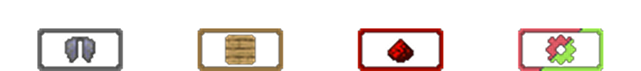

Using an Enchanted Book shows information about the enchantments. This includes a detailed description, the list of mutually exclusive enchantments, the comparator signal and the list of supported items.

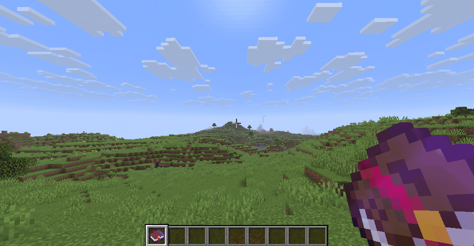

Besides the enchantment details, the book screen also includes information panels showing the requirements for spawning particles and for cloning Enchanted Books. **These panels are only shown if the mod is also installed on the server**

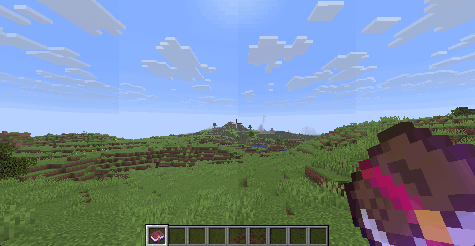

Intentions/Reasoning

- Seeing the enchantment details without having to leave the game.
- In comparison to other similar mods the book menu is more diegetic than simply showing the enchantment details in the tooltip of the item.

Enchanted Books can be placed in lecterns. Opening the lectern will show the same interface as opening the book regularly.

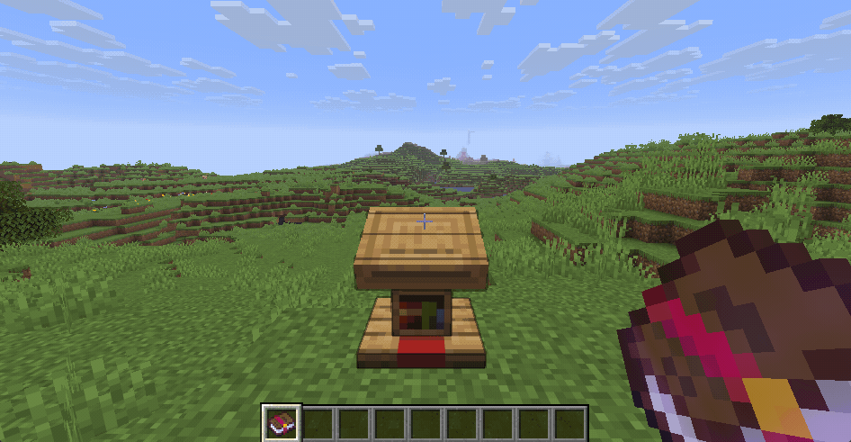

Intentions/Reasoning

- Parity with written books
- Allows for the other features related to Enchanted Books in lecterns

The enchantments are separated into groups, each emitting a different comparator signal strength. This signal strength is also shown in the book screen.

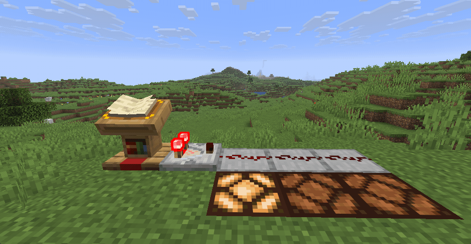

List of all comparator signal strengths

| Power | Description             | Enchantments                                                                                                                                                                        |
| ----- | ----------------------- | ----------------------------------------------------------------------------------------------------------------------------------------------------------------------------------- |
| 1     | Cover page              |                                                                                                                                                                                     |
| 2     | Universal               | <ul><li> Mending </li><li> Unbreaking </li></ul>                                                                                                                                    |
| 3     | Curses                  | <ul><li> Curse of Binding </li><li> Curse of Vanishing</li></ul>                                                                                                                    |
| 4     | Universal armor         | <ul><li> Protection </li><li> Blast Protection </li><li> Fire Protection </li><li> Projectile Protection </li></ul>                                                                 |
| 5     | Helmets                 | <ul><li> Aqua Affinity </li><li> Respiration</li></ul>                                                                                                                              |
| 6     | Chestplates             | <ul><li> Thorns <ul><li> Not chestplate exclusive </li><li> Ensures category has one entry </li></ul> </li></ul>                                                                    |
| 7     | Leggings                | <ul><li> Swift Sneak </li></ul>                                                                                                                                                     |
| 8     | Boots                   | <ul><li> Depth Strider</li><li> Feather Falling</li><li> Frost Walker </li><li> Soul Speed</li></ul>                                                                                |
| 9     | Mining tools            | <ul><li> Efficiency </li><li> Fortune </li><li> Silk Touch</li></ul>                                                                                                                |
| 10    | Melee weapons damaging  | <ul><li> Sharpness </li><li> Smite </li><li> Bane of Arthropods </li><li> Impaling </li><li> Density </li><li> Breach </li></ul>                                                    |
| 11    | Melee weapons utility   | <ul><li> Fire Aspect </li><li> Sweeping Edge </li><li> Knockback </li><li> Looting </li><li> Wind Burst </li><li> Lunge </li></ul>                                                  |
| 12    | Ranged weapons damaging | <ul><li> Power </li></ul>                                                                                                                                                           |
| 13    | Ranged weapons utility  | <ul><li> Punch </li><li> Infinity </li><li> Flame </li><li> Multishot </li><li> Quick Charge </li><li> Piercing </li><li> Channeling </li><li> Loyalty </li><li> Riptide </li></ul> |
| 14    | Other tools             | <ul><li> Lure </li><li> Luck of the Sea</li></ul>                                                                                                                                   |
| 15    | None/unused             |                                                                                                                                                                                     |

Intentions/Reasoning

- Enables basic sorting of Enchanted Books based on their enchantments
- Allows encoding of a redstone signal strength sequence based on the enchantments of the book

Lecterns emit particle effects based on the enchantments of the currently selected page. If the cover page is selected, the particles will cycle randomly through the contained enchantments.

The particle lifetime is based on the count of books contained in nearby chiseled bookshelves. If there is no bookshelf or it is empty, no particles will be emitted.

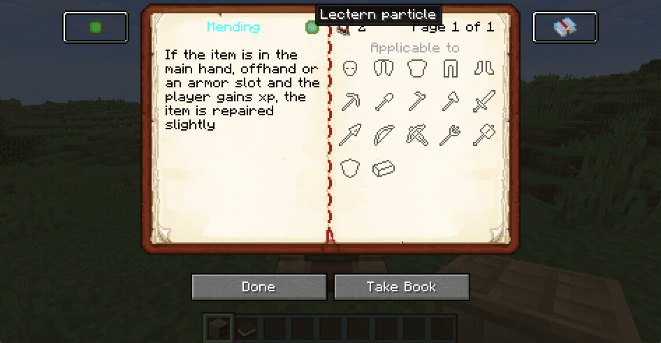

|                                                                                                      |                                                                                                               |
| ---------------------------------------------------------------------------------------------------- | ------------------------------------------------------------------------------------------------------------- |
| 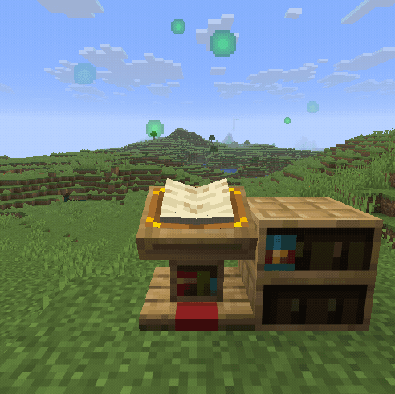
Mending
</img>                | 
Feather Falling
</img> |
| 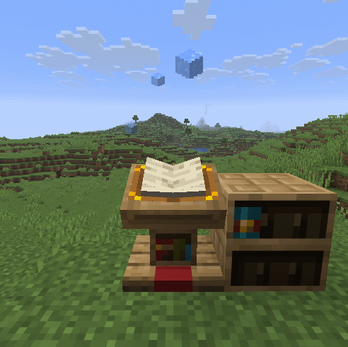
Frost Walker
</img> | 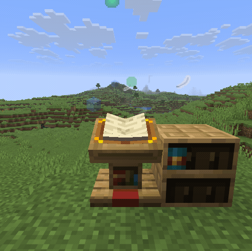
All 3 particles
</img>     |

List of all particle textures

Admittedly most of the particle textures can be seen as programmer art

| Texture                                                                                                                                                                                                | Name               | Texture                                                                                                                                                                                                         | Name                  | Texture                                                                                                                                                                                               | Name             |
| ------------------------------------------------------------------------------------------------------------------------------------------------------------------------------------------------------ | ------------------ | --------------------------------------------------------------------------------------------------------------------------------------------------------------------------------------------------------------- | --------------------- | ----------------------------------------------------------------------------------------------------------------------------------------------------------------------------------------------------- | ---------------- |
| </img>        | Aqua affinity      | </img>       | Bane of arthropods    | </img> | Blast protection |
| </img>                      | Breach             | </img>                       | Channeling            | </img>    | Curse of Binding |
| </img> | Curse of Vanishing | </img>                             | Density               | </img>       | Depth strider    |
| </img>              | Efficiency         | </img>             | Feather falling       | </img>           | Fire aspect      |
| </img>    | Fire protection    | </img>                                 | Flame                 | </img>                   | Fortune          |
| </img>          | Frost walker       | </img>                           | Impaling              | </img>                 | Infinity         |
| </img>                | Knockback          | </img>                             | Looting               | </img>                   | Loyalty          |
| </img>    | Luck of the sea    | </img>                                 | Lunge                 | </img>                         | Lure             |
| </img>                    | Mending            | </img>                         | Multishot             | </img>                 | Piercing         |
| </img>                        | Power              | 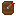</img> | Projectile protection | </img>             | Protection       |
| </img>                        | Punch              | </img>                   | Quick charge          | </img>           | Respiration      |
| </img>                    | Riptide            | 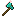</img>                         | Sharpness             | </img>             | Silk touch       |
| </img>                        | Smite              | 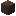</img>                       | Soul speed            | </img>       | Sweeping edge    |
| </img>            | Swift sneak        | </img>                               | Thorns                | </img>             | Unbreaking       |
| </img>              | Wind burst         |                                                                                                                                                                                                                 |                       |                                                                                                                                                                                                       |                  |

Intentions/Reasoning

- Allows an easy way of spawning a variety of particle effects.
- The other redstone related features enabling a dynamic way of changing particle textures and lifetime.

Disable with: `/gamerule interactive_enchanted_books:hopper_interacts_with_lectern false`

Hoppers are able to place written or Enchanted Books in lecterns. Additionally they are able to remove the active book of a lectern.

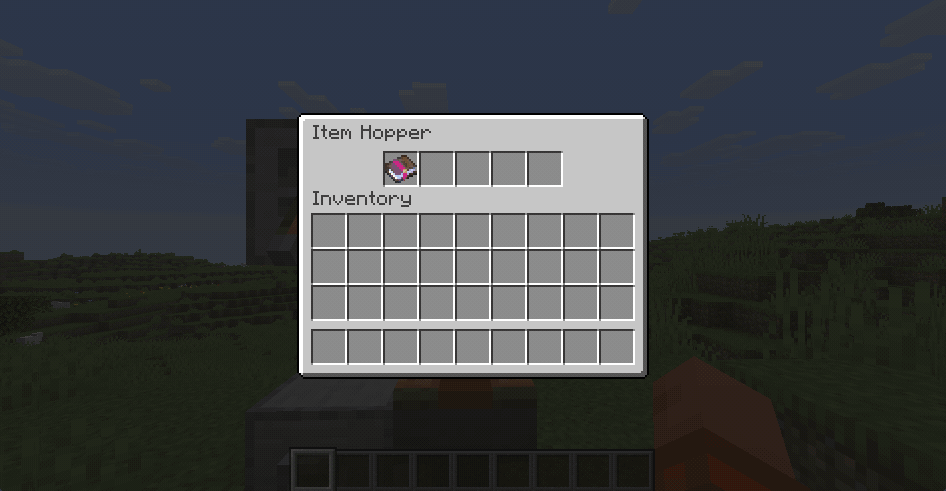

Intentions/Reasoning

- Parity with other block entities and behaviour. Not being able to place books in lecterns using hoppers seems like an oversight in vanilla
- Allows for greater control over the enchantment particles of this mod

Disable with: `/gamerule interactive_enchanted_books:signal_changes_lectern_page false`

Sending a redstone signal to the lectern increments the shown page. If the last page is reached, the lectern will loop back to the first page. **This disables the default behaviour of page changes emitting a redstone signal. Observers will still detect the page change**

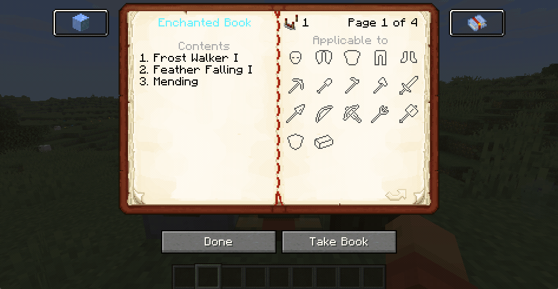

Intentions/Reasoning

- As lecterns with Enchanted Books emit particles based on the current page, changing the page with a redstone signal allows dynamic control over which particle is currently shown
- In combination with the chiseled bookshelves, this allows for flexible particle effects

Disable with: `/gamerule interactive_enchanted_books:craftable_enchantment_echo false`

The Enchantment Echo clones the enchantments of the original item **without** destroying it and can be interacted with just as a regular Enchanted Book (see previous features). Combining the Enchantment Echo with an Echo Shard converts it into an Enchanted Book.

|                                                                       |                                                                                  |
| --------------------------------------------------------------------- | -------------------------------------------------------------------------------- |
| 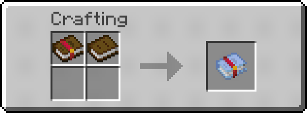</img> | 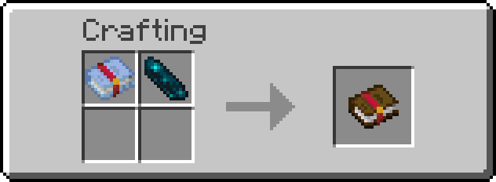</img> |

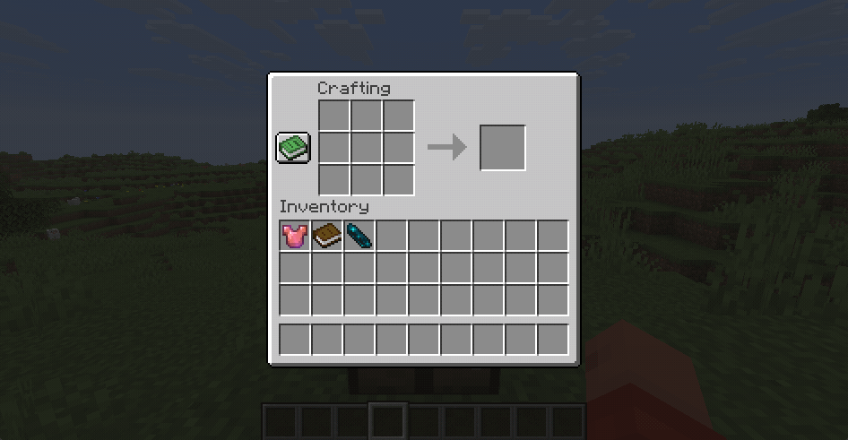

Intentions/Reasoning

- The Enchantment Echos allow easier usage of the other mod features, such as comparator signal and particles, without having to combine multiple Enchanted Books
- The ability to create an Enchantment Echo from an already enchanted item enables easier insight into the enchantment details. When playing a modpack it's easy to find items with tons of enchantments without knowing most of them. Enchantment Echos provide an easy way to preview the details in game
- The conversion to a real Enchanted Book is intended to reduce the need for villagers while not being too overpowered, as Echo Shards are a finite end game resource.

See the [example repository](https://github.com/Bristn/minecraft-interactive-enchanted-books-example) for more details on how to integrate custom enchantments.
