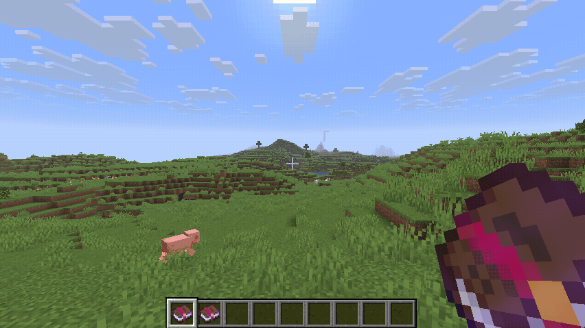
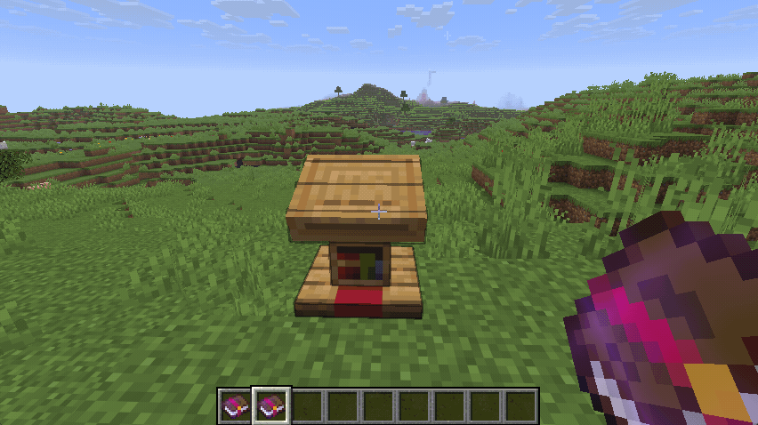
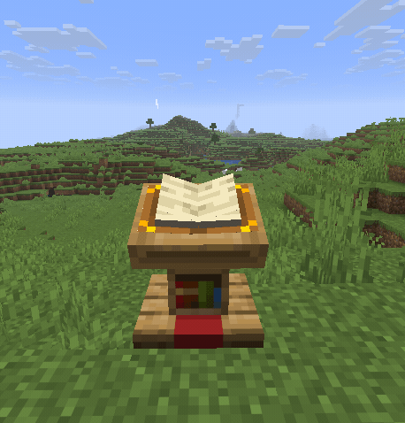
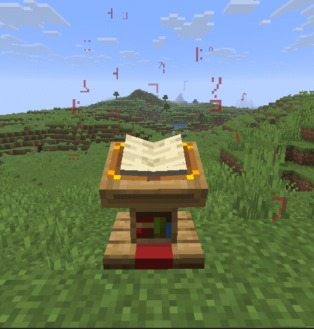
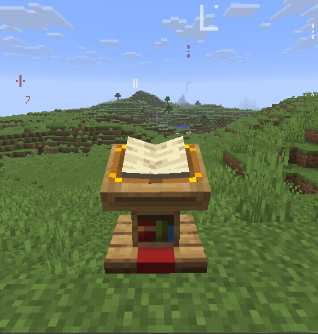
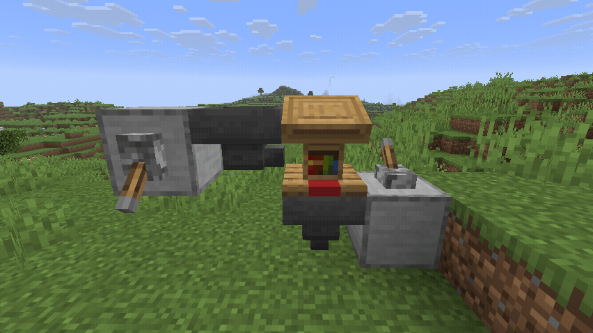

# Interactive enchanted books

Using an enchanted book opens a screen showing information about the enchantments. This includes a description for each enchantment, the list of mutually exclusive enchantments, the comparator signal and the list of items the enchantment can be applied to.

# Enchanted books in lecterns

If the mod is installed on the server, enchanted books may be placed in lecterns. Right-clicking the lectern will open the same interface as using the enchanted book itself.

## Comparator signal

The enchantments are separated into different groups, each emitting a different comparator signal strength. This signal strength is also shown when opening the books gui.

## Lectern block particles

If a lectern contains an enchanted book, the book will emit particles based on the enchantment level of the current page. Lower enchantment levels emit fewer particles compared to higher levels. Curses emit a different particle. When viewing the cover page, the different effects are mixed accordingly.

|                                                                                                                |                                                                                                                                            |
| -------------------------------------------------------------------------------------------------------------- | ------------------------------------------------------------------------------------------------------------------------------------------ |
|  
Unbreaking I
  |  
Unbreaking III
                           |
|  
Curse of Binding
 |  
Unbreaking III + Curse of Binding
 |

# Hopper functionality for lecterns

Hoppers are able to input written or enchanted books into lecterns. Additionally they are able to remove the active book of a lectern.

See the [example repository](https://github.com/Bristn/minecraft-interactive-enchanted-books-example) for more details on how to integrate custom enchantments.
